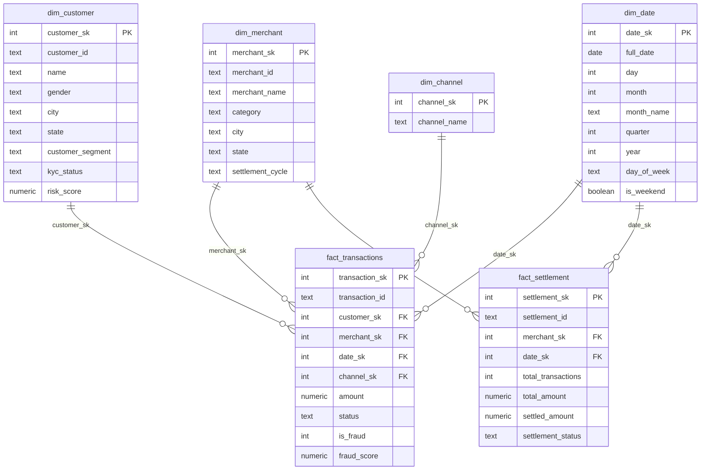

# EFTP — Star Schema Design

**Project:** UC12 Enterprise FinTech Data Platform
**Sprint:** Sprint 2 — Data Profiling & DB / Data Warehouse
**Purpose:** Define the dimensional model for the `gold` layer — the analytics-ready star schema that Power BI and SQL reporting query directly.

---

## Grain Statement

**`fact_transactions`** — one row per transaction, across all three transaction channels (UPI, Wallet, Gateway).

**`fact_settlement`** — one row per merchant, per weekly settlement batch. This is a separate, coarser-grained fact table — it is **not** joined row-for-row to `fact_transactions`; reconciliation aggregates transactions up to the merchant/week level first (see Sprint 3, Move 6).

---

## Schema Diagram

```
                dim_date
                    |
dim_customer -- fact_transactions -- dim_merchant
                    |
                dim_channel
```



---

## Fact Table: fact_transactions

**Grain:** one row per transaction (union of UPI, Wallet, and Gateway sources).

| Column | Type | Description |
|---|---|---|
| transaction_sk | Surrogate key (SERIAL) | Internal warehouse identifier |
| transaction_id | Text | Natural key from source systems |
| customer_sk | FK → dim_customer | Resolved from source `customer_id` |
| merchant_sk | FK → dim_merchant, nullable | Null for P2P wallet transfers with no merchant |
| date_sk | FK → dim_date | Resolved from transaction timestamp |
| channel_sk | FK → dim_channel | UPI / WALLET / GATEWAY |
| amount | Numeric | Cleansed transaction amount (nulls/negatives excluded upstream) |
| status | Text | Standardized (SUCCESS/FAILED/PENDING) |
| is_fraud | Integer, nullable | From Fraud Detection System; null = not scored (~92% of transactions) |
| fraud_score | Numeric, nullable | Model-assigned fraud probability, where scored |

## Fact Table: fact_settlement

**Grain:** one row per merchant, per weekly settlement batch.

| Column | Type | Description |
|---|---|---|
| settlement_sk | Surrogate key (SERIAL) | Internal warehouse identifier |
| settlement_id | Text | Natural key from Settlement Processing System |
| merchant_sk | FK → dim_merchant | Resolved from source `merchant_id` |
| date_sk | FK → dim_date | Resolved from `batch_date` |
| total_transactions | Integer | Count of transactions in the batch |
| total_amount | Numeric | Sum of transaction amounts for the batch |
| settled_amount | Numeric | Amount actually settled to the merchant |
| settlement_status | Text | MATCHED / VARIANCE |

**Note:** joins to `dim_merchant` and `dim_date` only — never joined row-level to `fact_transactions`. Reconciliation logic aggregates `fact_transactions` up to merchant/week first, then compares against this table.

---

## Dimension: dim_customer

**Source:** `silver.crm_customers` left-joined to `silver.kyc_verification` on `customer_id`.

| Column | Description |
|---|---|
| customer_sk | Surrogate key |
| customer_id | Natural key |
| name, gender, city, state | From CRM |
| customer_segment | From CRM (Retail / Premium / Merchant-linked) |
| kyc_status | From KYC Verification (VERIFIED / PENDING / REJECTED) |
| risk_score | From KYC Verification |

Loaded as **Type 1** (overwrite on change, no history tracking) — sufficient for this project's scope.

## Dimension: dim_merchant

**Source:** `silver.merchant_portal`.

| Column | Description |
|---|---|
| merchant_sk | Surrogate key |
| merchant_id | Natural key |
| merchant_name | Cleansed (Title Case) |
| category, city, state | Merchant attributes |
| settlement_cycle | T+1 / T+2 / Weekly |

## Dimension: dim_date

Standard generated date dimension, one row per calendar day covering the transaction date range (2025). Surrogate key is the `YYYYMMDD` integer for readability and easy joins from any layer.

## Dimension: dim_channel

A static 3-row lookup: `UPI`, `WALLET`, `GATEWAY`. Seeded manually, not derived from a source system.

---

## Design Decisions

- **Why one fact table for three channels, not three separate fact tables:** UPI, Wallet, and Gateway transactions share the same grain and the same set of dimensions (customer, merchant, date). A single conformed fact table lets `channel_sk` act as a slicer instead of forcing every report to `UNION` three tables.
- **Why merchant_sk is nullable on fact_transactions:** P2P wallet transfers genuinely have no merchant — modeling this as a required FK would force fabricating a "no merchant" placeholder merchant row, which adds complexity without benefit at this project's scale.
- **Why fraud and settlement aren't merged into fact_transactions as extra columns from the start:** only ~8% of transactions are fraud-scored and settlement happens at a weekly/merchant grain, not per-transaction — forcing them into the same row would mean mostly-null columns and a grain mismatch for settlement. Fraud is joined in via left join (nullable columns); settlement stays a separate fact table entirely.
- **Why dim_date uses an integer YYYYMMDD surrogate key instead of a plain SERIAL:** it's immediately human-readable in ad-hoc queries and lets a report join on a computed date key without a lookup, which is a standard data warehousing convention.
